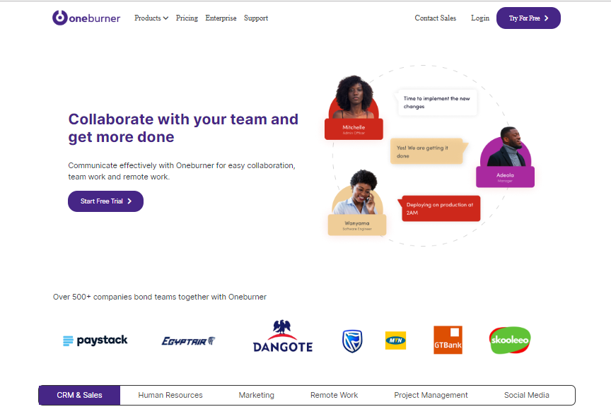
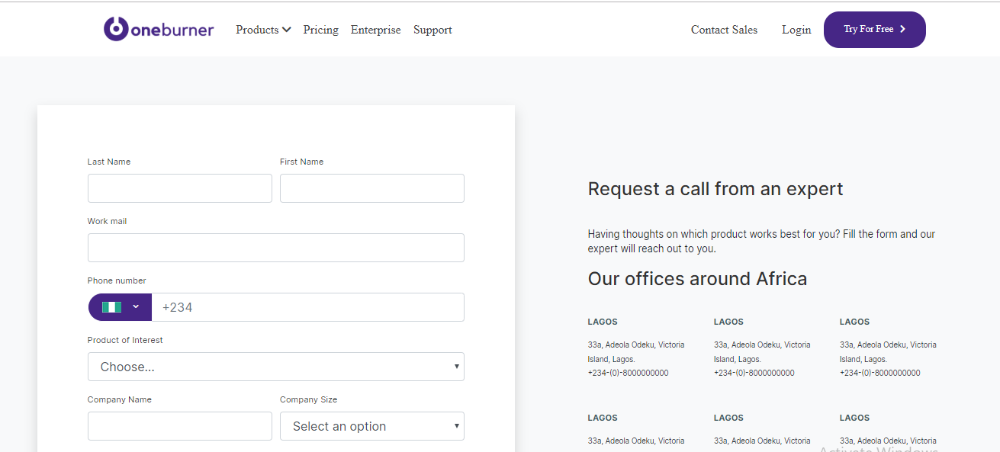
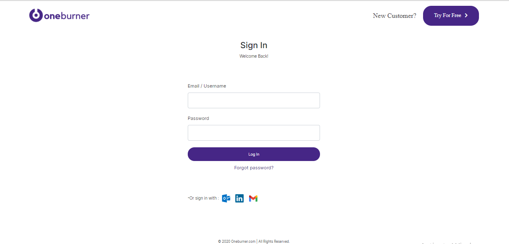

# oneburner-website
> A website for oneburner Agency

## General info
The purpose of the project is to create a front-end web pages for oneburner agency. The project is a seriesof web pages for oneburner agency. 
The design was provided via Figma, I developed it making sure it looked as close to the design as possible, paying attention to details.

## Screenshots

## [live Demo](https://oneburner-agency.netlify.app)

## How to run
*Download the entire folder on your laptop/computer.
*Open the index.html using any suitable browser such as Google Chrome, Firefox, etc.
*You can now view the webpage.
*Also, feel free to make changes in any editor such as VS Code and try them out.
Note: You might want to change the image path in the index.html file if in case it doesn't work.

## Technologies
* HTML5
* CSS3
* javascript
* vscode
* Git
### Framework
* Bootstrap 4.4.1

## Features
* Responsive web desgn
* Mobile first approach
* Interactive elements on the page
* Bootstrap for creating layouts

## Contact me
Feel free to contact me on [linkedin](https://www.linkedin.com/in/monday-ofem/) and [twitter](https://twitter.com/MondayOfem)
